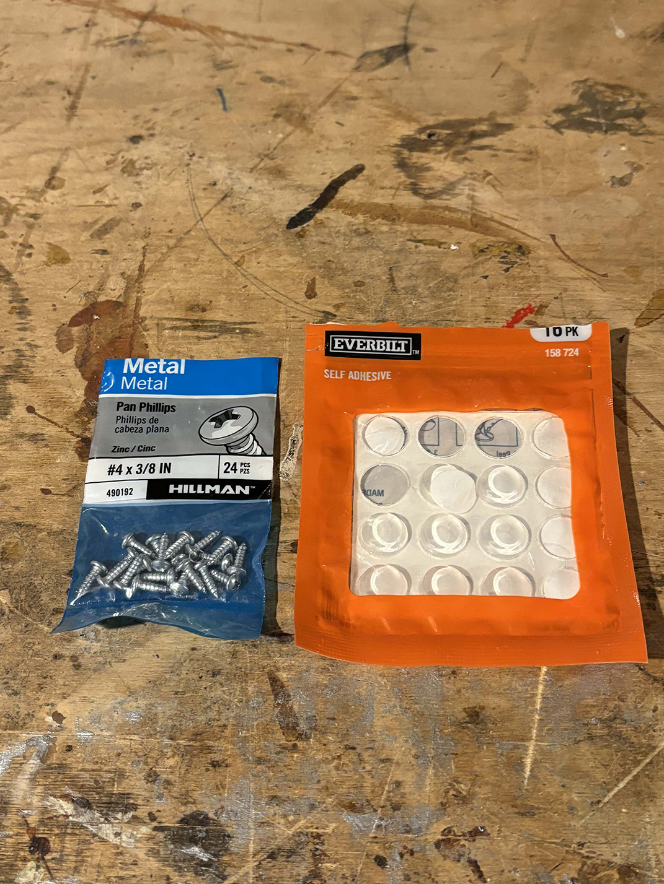
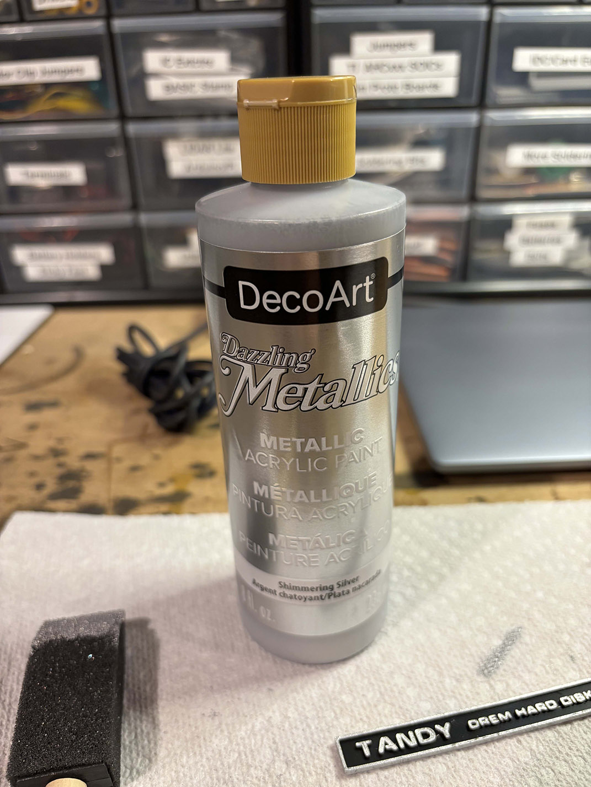
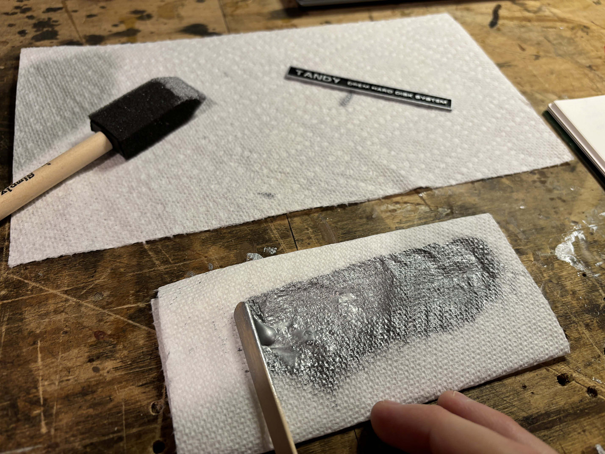
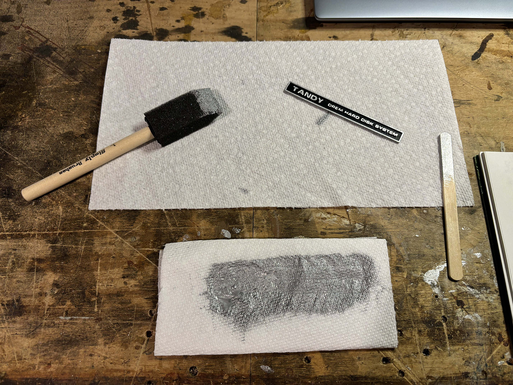
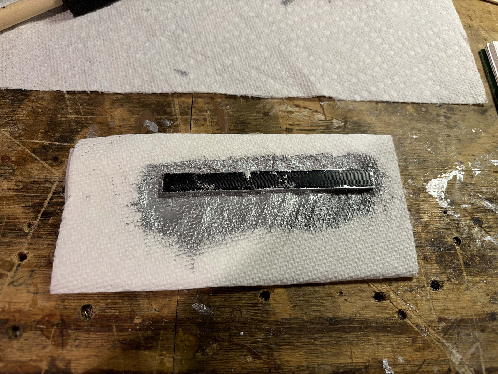
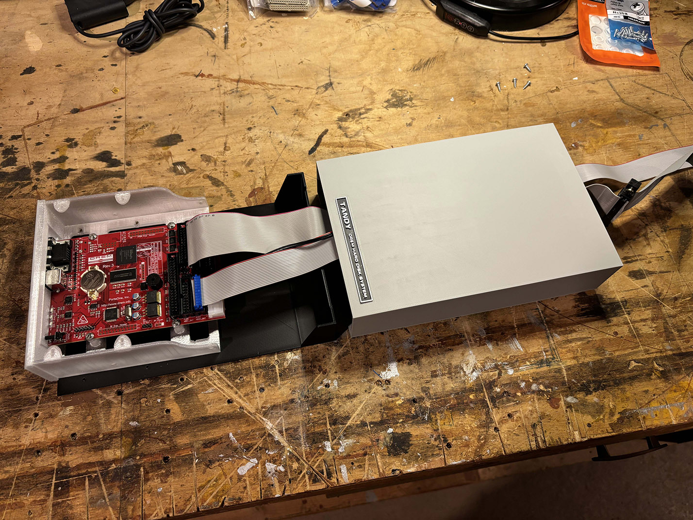
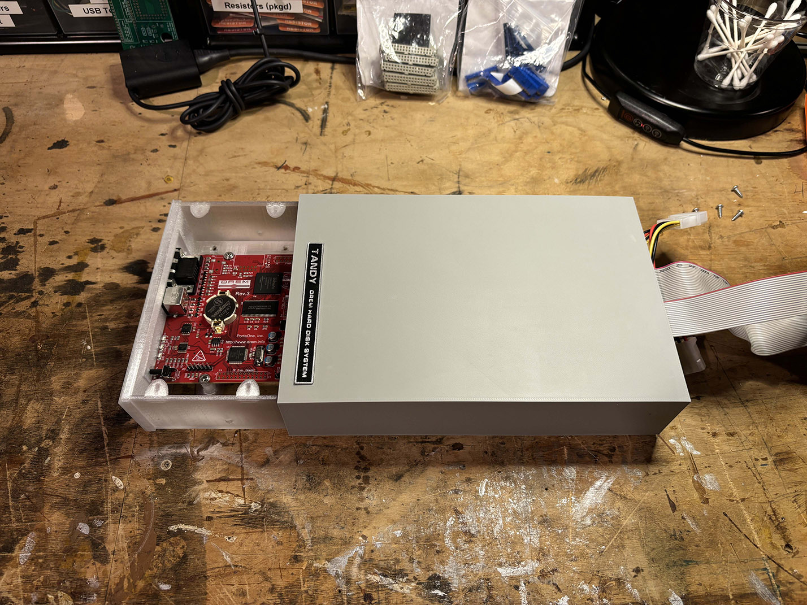
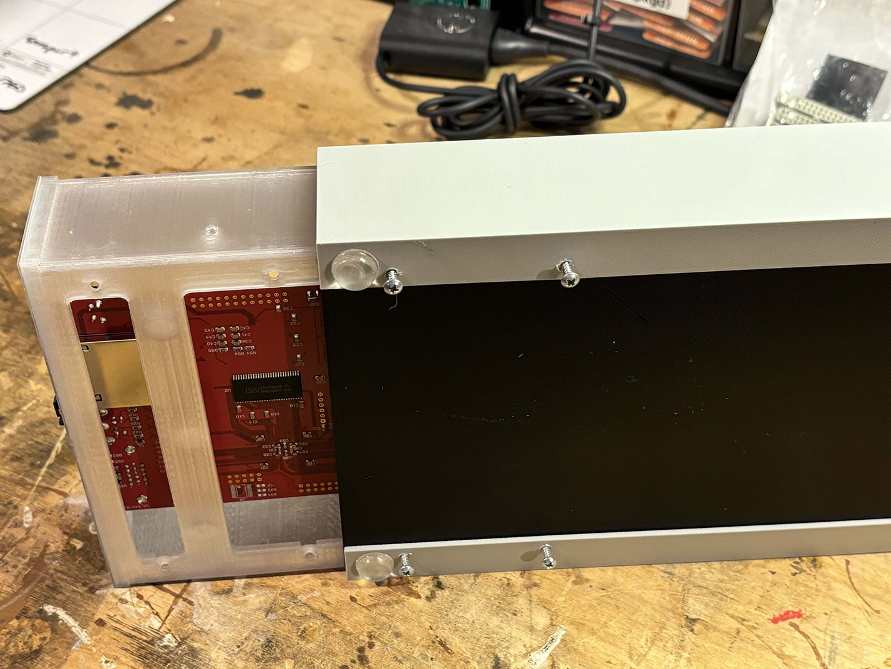
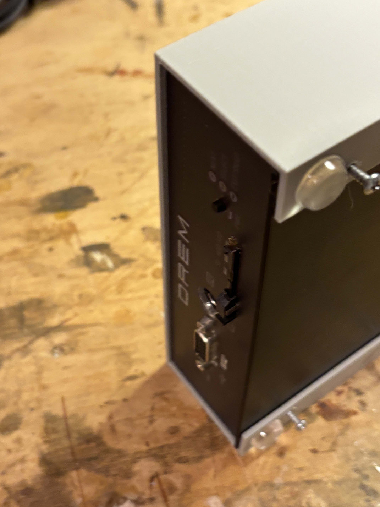
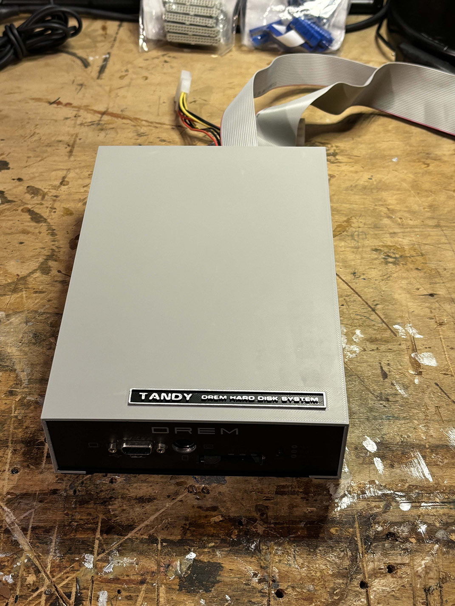

# TandyDREMEnclosure

An enclosure for the 5.25" half-height DREM hard drive emulator.  This is actually a modification of *TechGuyDK*'s design on Thingiverse, called *5.25" Floppy Drive Enclosure*.  You can find the original project here: https://www.thingiverse.com/thing:6199358.

It's licensed under the Creative Commons license.  See LICENSE.TXT.

## Changes To The Original Design

I made four main changes:

1. Coverted the enclosure from full-height to half-height
2. Relocated the screw holes to align with the sled that was included with my DREM.
3. Created a channel for custom nameplate/badge on the top of the enclosure.
4. Added a custom Tandy-branded badge.

## Use

There are three STL files here:

- The top of the enclosure - **enclosure.stl**.
- The base of the enclosure, onto which the DREM will sit - **base.stl**.  
- The Tandy nameplate/badge - **badge.stl**

It's strongly recommended that you print each part separately unless you have a very large printer.  Even if you print the base and enclosure top together, you should print the badge separately as it requires different settings to come out looking decent.

## Required Materials

The following materials are required:

- A 3D printer of sufficient volume (the part sizes are indicated above) or access to a 3D printing service such as CraftCloud or ShapeWays.  I used my own 3D printer, a **Bambu Labs X1 Carbon**.
- Filament.  I use the following filament:
    - Enclousre: **Hatchbox 3D PLA** Printer Filament - Matte Gray - **P/N: 3D PLA-1KG1.75-MAT-GRY**
    - Base and Badge: - Enclousre: **Hatchbox 3D PLA** Printer Filament - True Black - **P/N: 3D PLA-1KG1.75-BLK**
- Rubber sticky feet (prevents screws from scraping surfaces).  I use *Everbuilt P/N 158 724*, which can be found at Home Depot.
- Screws.  I used **Hillman #4 x 3/8 in.** Metal screws, **P/N: 490192**.  These can be found at big-box hardware stores. 
- Paint for the badge.  I use **DecoArt Metallic Acrylic Paint** in **Shimmering Silver**.  **P/N: DAO70**.  This can be found at craft stores such as Michael's. 
- If you're using the procedure below to paint the badge you'll also need the following, which can be found at craft stores:
    - Paper towels
    - Popsicle sticks (or another implement with which to spread paint)
    - Foam paint brush (1-2" wide).
- Super Glue (any brand will work, as long as it is plastic-safe).

## Printing the Enclosure

Printing the enclosure is fairly straightforward.  I print with the largest flat surface on the print bed, enabling supports to allow the overhang to print without issue.  This is recommended over printing the enclosure on its end; otherwise it will tend to flex later in the print, causing an uneven result.  For my printer, the Bambu Labs X1 Carbon, I overrode the default settings as follows:

* Material: Hatchbox 3D  Matte Gray PLA
* Filament temperature: 215 C
* Heated bed: "Cool Plate" PLA plate, temp: 35 C.  I used a Glue Stick, as is recommended.
* Supports: On
* First Layer Print Speed: 50 mm/s.

## Printing the Base

Printing the base is straightforward.  I print with the largest flat surface on the print bed.  As there are no overhangs, supports are not necessary.  This is recommended over printing the enclosure on its end; otherwise it will tend to flex later in the print, causing an uneven result.  For my printer, the Bambu Labs X1 Carbon, I overrode the default settings as follows:

* Material: Hatchbox 3D  True Black PLA
* Filament temperature: 190 C
* Heated bed: "Cool Plate" PLA plate, temp: 35 C.  I used a Glue Stick, as is recommended.
* Supports: Off
* First Layer Print Speed: 50 mm/s.

## Printing the Badge

The badge is the most difficult item to print.  You will want to turn down the printing speed on all layers.  I tended to keep the filament temperature on the lower end of its range to help it cool and harden faster.  Your results will vary wildly depending on your printer and how much you pray.  Because of the difference in print settings when compared to the larger base, it's recommended that you print the badge separately.  I used the following settings:

* Material: Hatchbox 3D  True Black PLA
* Filament temperature: 180 C
* Heated bed: "Cool Plate" PLA plate, temp: 35 C.  I used a Glue Stick, as is recommended.
* Supports: Off
* First Layer Print Speed: 30 mm/s.
* All other layers: 50 mm/s.
* Travel speed: 100 mm/s.

After printing, use care not to bend the badge as you remove it.  It will bend or break easily.  

## Prepping and Painting the Badge

Once you've printed the badge, you'll want to remove any leftover PLA threads from the badge.  The easiest way to do this is to use a lighter.  While holding the badge upside down, kiss it with the flame of a lighter briefly from one side to the other.  It should only take one pass.  Do not stop or move too slowly; the badge will warp quickly.

To paint the badge, I do the following: 
1. Take a paper towel and fold it in half.  Once done, fold it over itself one more time (giving you four layers of paper towel).
1. Using a popscicle stick, spread a layer of the Shimmering Silver paint (DAO70) across the paper towel, covering an area just larger than the badge itself. 
1. Spread and press in the paint with the popscicle stick until there are no drops or raised areas.  You want to keep the paper towel as flat as possible while avoiding pooling of the paint. 
1. Place the badge face-down on the painted section of the paper towel. 
1. Lightly press, gently rocking the badge in the paint.
1. Remove the badge, and set it on its back while the first coat of paint dries.  Use care not to touch the inside of the badge with your fingertips to avoid getting paint in the lower portion.
1. Repeat the painting process until the paint looks even and is coated to your preference.
1. After the top dries, you can apply the same paint to the sides of the badge using a foam brush.  Be sure to put a minimal amount on the brush to prevent the paint from forming drops or getting into the top of the badge where it's not wanted.
1. Enjoy your creation!

## Assembly

To assemble the enclosure, perform the following steps:

1. Remove any supports from the top of the enclosure.  Be sure not to miss the badge indentation.
1. Apply three to four small drops of super glue into the badge indent on the top of the enclosure.
1. Insert the painted badge and firmly hold it in place for about 30-40 seconds.
1. Attach the cables to the DREM.
1. Place the DREM onto the base, running the DREM's cables through the channel on the back of the base.  Place the top of the enclosure over the DREM's cables, behind the base. 
1. Slide the top of the enclosure over the base, aligning the back of the base with the end of the top case.  Ensure the DREM protrudes from the front a little.  You'll slide it into its final position in a later step.  
1. Place the partially-assembled enclosure on its side.  Partially install a screw into each of the screw holes.  You want the screw to grab the enclosure's top and base without penetrating the base of the DREM's sled.  
1. Slide the DREM into the enclosure.  The front of the DREM should be set back about .5 - 1 mm from the front of the enclosure.  
1. Carefully tighten all four screws.

That's it, assembly is complete!  Enjoy!

## Support

There is almost none.  Feel free to let me know if there are major issues, but I'm not an engineer by trade and honestly am susceptible to "New Shiny Object Syndrome", so whether or not I address any issues is a coin-flip.  That's the beauty of open-source; anyone can make it better, including you! 

As this is a rehash of someone else's project, the base design was left unchanged.  This case was more for asthetics than anything else, so I don't plan to rehash the original design.